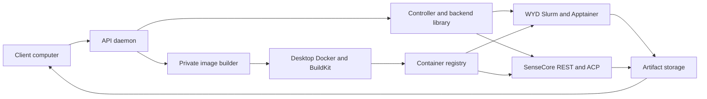
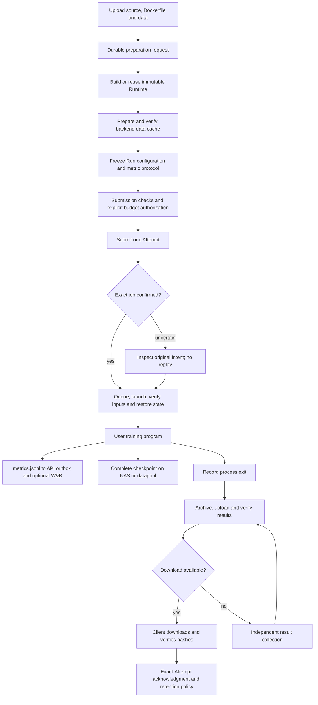

# Architecture

## Packages and execution locations

| Package | Source | Responsibility |
|---|---|---|
| `ml-experiment-client` | `client/src/ml_exp_client/` | Dependency-free HTTP client and `ml-exp` CLI |
| `ml-experiment-server` | `server/src/ml_exp_server/` | API, definitions, Actions, collection, builder and worker sources |
| `ml-experiment-control` | `src/experiment_control/` | Backend interface and durable controller primitives |

The server imports the core; the core never imports the server. Clients install
neither. `rust/src/main.rs` supplies `experiment-redact`, packaged with the core.

The daemon freezes metadata and controls schedulers; it does not run training
code. A private builder owns Docker and publication. In SSH desktop mode, actual
build contexts/layers live on the desktop. Training runs inside backend containers.

## Server code map

| Concern | Main modules under `server/src/ml_exp_server/` |
|---|---|
| HTTP and auth | `api/`, `http_auth.py`, `api_contract.py` |
| Composition | `runtime.py`, `api/app.py` |
| Projects and source identities | `projects/`: imports, revisions, registry, lifecycle and authored Runs |
| Checked mutations | `application.py`, `actions/`, `runs/submissions.py`, `controller_gateway.py` |
| Run queries and diagnosis | `runs/queries.py`, `evidence.py`, `validation.py`, `failures.py` |
| Capability matching/preparation | `runs/executor_capabilities.py`, `experiment_preparation.py` |
| Dispatch | `container_controller.py` → core `backends/` |
| Observation | `collectord.py`, `ingest/`, `runs/terminal_snapshot.py`, `execution_progress.py`, `input_progress.py` |
| Images | `image_builder.py`, `dockerfile_build.py`, `builds/` |
| Data | `data/`: assets, multipart upload, remote upload and delivery; `desktop_upload.py` is the standalone process entry |
| Provider storage operations | `backends/wyd.py`, `sensecore_data.py`, `sensecore_results.py` |
| Results/state | `results/`: artifact storage, download lifecycle, checkpoint registry and independent collection |
| Metrics and W&B | `tracking/`: contracts, durable outbox, display and publication; `wandb_exporter.py` is the SDK process entry |
| Compute programs | `workers/`: standalone stdlib training, data-copy and result-recovery programs |

`ExperimentServerApplication` and `ActionService` remain stable facades. Their
stateless operation classes group existing methods by responsibility and share
the facade's one runtime/store; they do not own separate mutable state or add
another workflow engine. Action planning, execution and reconciliation live in
`actions/planning.py`, `execution.py` and `recovery.py` respectively.

The API has separate bounded pools: four Action threads and two preparation
threads. Builds, data delivery and result collection use the latter, so provider
waits cannot fill the submit/cancel queue. Both pools retain the workspace lease
and runtime until claimed work finishes during shutdown. Provider waits still
occupy preparation threads; this is queue isolation, not a nonblocking scheduler.

`runtime.py` initializes daemon services; the public **Runtime resource** denotes
a code/environment image. `controller_gateway.py` is the project-controller
subprocess boundary. Managed projects use the generic container controller;
library consumers can supply adapters. A single managed Run currently generates
an internal Campaign file, without requiring clients to design a Campaign.

## Worker code executes on compute

These files under `workers/` are injected into new images:

- `worker_launcher.py`: verify a digest-bound startup manifest.
- `managed_worker.py`: inputs, restore, user child, registration and output return.
- `data_input.py`: verified data cache; `data_preparation.py`: optional download script.
- `persistent_state.py`: verify/register/restore complete generations.
- `worker_artifacts.py`: declared-output archive and multipart transfer.
- `data_copy_worker.py`: separate zero-GPU NAS dataset copy.
- `result_worker.py`: recover exact-Attempt outputs without running training.

Worker fingerprints participate in image identity. Updating server source does
not change workers in existing images. Backend implementations are core
`backends/wyd.py`, `sensecore.py`, `sensecore_rest.py` and development `local.py`.

## Identities and state

| Entity | Meaning | Durable evidence |
|---|---|---|
| Source | Immutable code snapshot | Frozen tree and metadata |
| Runtime | Source/Dockerfile/worker and published image | Definition and build receipt |
| Asset | Immutable input bytes | Archive/file hashes and locator |
| Preparation | One server-owned request and saved dependencies | Hash-bound intent and durable progress journal |
| Run | Image, data, argv, resources and metric protocol | Immutable manifest |
| Attempt | One execution | Intent, exact scheduler ID and observations |
| Checkpoint | Complete backend-resident generation | NAS/datapool bytes and registered manifest |
| Artifact | Published exact-Attempt output archive | Object, hashes and receipt |

Actions/events use transactional SQLite. The read index uses another SQLite
database. Runtime/delivery/checkpoint/upload metadata use files and durable
journals/locks as needed. There is no global transaction across all stores.
Reconciliation verifies exact effects; it does not replay an uncertain create.
The collector never starts replacement training. For eligible new workers with
confirmed successful process exit, it may request independent CPU result
collection once; historical workers are not automatically enrolled.

## Experiment flow

Scheduling state, process exit, checkpoint persistence and artifact availability
are separate evidence. A RUNNING job does not prove training has started, and a
saved checkpoint does not prove a download archive exists. Metric schemas declare
what the experiment must report; they never manufacture observations.

## Reading and extending the code

Read `client/workflow.py` → `api/app.py` → `runs/experiment_preparation.py` →
`container_controller.py` → core `backends/` → `workers/managed_worker.py` →
`results/result_collection.py`. HTTP routes handle transport; operation classes
and durable stores handle business rules.

New scheduler adapters implement the core Backend contract and capability
declaration. Storage delivery/recovery operations belong under server `backends/`.
Selection branches still exist in preparation/result orchestration: adding a
backend currently requires wiring them as well. Moving provider code does not
claim a complete dynamic-plugin interface.

Public CLI/process entries remain at the package root because service units and
frozen project controllers reference them. Internal modules have one canonical
domain location, with no old-path forwarding modules. Worker basenames and
injected contents remain unchanged; recipe changes affect future Runtime
identities, never existing images or Run manifests.

Programs live in `/root/ml-expd`; config in `/etc/ml-expd`; state in
`/var/lib/ml-expd` and configured project/builder roots. Backend storage and
registry assets have separate lifetimes. `.ops/` is private operational evidence,
not public functionality. See [deployment](operator-guide.md) and [recovery](recovery.md).
