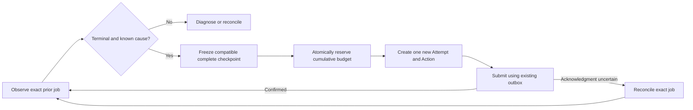

# Preparing automatic recovery

Status: design for a future opt-in mutation worker. Automatic recovery is not
implemented or enabled. No job is launched by this document or by the new
launcher. The collector remains read-only; `max_infra_retries` is currently a
manual retry allowance, not an automatic recovery loop.

## One restart owner

Use ML-Expd to create a **new Attempt** after a confirmed recoverable failure.
Keep ACP `fault_tolerance.backoff_limit: 0`. ACP's native policy can restart a
job or pod after matching exit codes; `-1` permits unlimited retries. It repeats
the job's startup definition and does not establish our checkpoint provenance,
new Attempt identity or cumulative budget. Enabling both owners risks duplicate
or unbounded recovery. A provider restart within one Attempt would require a
separate execution-generation identity and is not the selected design.

References: [ACP fault tolerance](https://www.sensecore.cn/help/docs/cloud-foundation/compute/acp/acpLME/acpTolerance&Dectetion),
[ACP job response](https://www.sensecore.cn/help/docs/API/acp/training-job-service-get-training-job).

## Preconditions and decisions

| Evidence | Decision |
| --- | --- |
| Confirmed provider preemption or documented infrastructure failure; exact prior job is terminal | Consider recovery after checkpoint and budget gates |
| User cancellation, successful training with failed artifact return, code/data/hash failure, invalid checkpoint or resource mismatch | Do not rerun training automatically |
| `FAILED`/`SUSPENDED` alone, empty logs or missing exit reason | Require diagnosis; do not infer preemption |
| Create acknowledgment lost, submission outbox unresolved or prior job might still run | Reconcile the exact old identity first; never replay create |
| No compatible, registered complete checkpoint | Block by default; an explicit separate policy would be needed to restart from scratch |

Offline logs are evidence, not a guaranteed structured preemption reason. The
documented workers response does not establish a universal exit-reason field.
Implement a failure classifier only for provider signals actually observed and
verified. Store raw lifecycle state plus the classification source, event time,
job/worker identity and a stable reason code. Unknown remains unknown.

## Attempt-specific execution overlay

Today `resume_from` is frozen in the Run. `Controller.prepare` copies that same
reference into every Attempt; a manual retry does not automatically select a
checkpoint saved by the preceding failed Attempt. Run-level immutability must
remain intact.

Introduce an immutable execution overlay for each new recovery Attempt:

- Original Run identity and prior Attempt/job identity.
- Exact registered `checkpoint_id`, source Attempt, step, source/image/storage
  identities and manifest digest. Select the highest step among compatible
  registered complete generations. If the highest step has different generation
  identities, require an explicit choice; never select by filename order or an
  unregistered NAS `latest` symlink.
- Fresh placement evidence. Rank compatible non-debug pools by SPOT allowance,
  retaining the same GPU specification, quota type, zone, known VPC and shared
  NAS scope. Do not reinterpret allowance as free capacity or silently change
  resources. Describe/reconcile/cancel use the Attempt's exact chosen job.
- Reserved remaining worker time/GPU budget, selected recovery policy identity,
  retry ordinal, failure evidence digest and Action/outbox identity.

The worker must rehash the actual checkpoint files before training. Registration
currently records worker SHA verification; the API server cannot independently
inspect NAS. A missing or corrupt generation blocks training and cannot silently
fall back to an older checkpoint. The experiment code still owns restoration of
optimizer, scheduler, RNG and the data cursor.

Keep Run's scientific configuration and scoring protocol unchanged. Observation
and output provenance must additionally reference the effective Attempt overlay
and checkpoint, so evaluation results cannot silently inherit the wrong resume
source. A changed training configuration requires a new Run.

## Policy and cumulative budget

Require explicit opt-in and finite caps: recoveries, cumulative GPU time,
Run elapsed deadline and per-Attempt worker duration. Do not infer authorization
from `max_infra_retries` alone. A two-hour worker limit resets for each new
container today; that is insufficient as a Run-level recovery budget.

Use a durable ledger with a transaction/lease scoped to project/Run. Reserve
the new Attempt's maximum GPU time **before** creating any ACP job; reserve
uncertain submissions until exact reconciliation proves their result. Settle
from trustworthy start/end/resource evidence, or conservatively retain the full
reservation. A process restart or multiple daemon processes must not create a
second reservation or duplicate job for the same recovery transition.

Worker preparation, restore, training and artifact return currently share
`resources.max_time`. Queue and image pull are outside that timer. Account for
their allocated GPU time when the provider supplies reliable timestamps; never
claim a container timer caps image-pull occupation. Add an independently enforced
Run deadline and separate phase deadlines before enabling unattended recovery.
An expired training budget stops recovery; retrying result return must not start
training again. Retry delay should be bounded, increasing, jittered, and counted
toward the Run elapsed deadline. No infinite retries.

## Durable state machine and existing mechanisms

Reuse `prepare_attempt_retry`, the Action execution/audit pipeline and exact
submission outbox. A separate mutation worker owns recovery; it never submits
from `status`, `logs`, the collector or a client retry of GET. Extending retry
Actions with the overlay and reserved policy budget is required before execution.
Persist uniqueness on `(project, Run, source Attempt, recovery transition)`.
A lease alone is insufficient: reconcile a dispatched outbox after owner death.
Revalidate terminal evidence, checkpoint, budget and cancellation immediately
before create. A user cancellation disables pending recovery, including during
the bounded backoff window.

## Implementation order and acceptance

1. Introduce the immutable Attempt overlay and checkpoint selection; retain
   manual retry behavior for historical Runs. Repeated planning must produce
   the same overlay; conflicting checkpoint references must fail.
2. Add structured failure evidence and a policy/ledger with finite caps; keep
   the default disabled. Test unknown causes, user cancellation, corrupt state,
   exhausted budget and unconfirmed submissions as blocked cases.
3. Add the separate Action mutation worker. Simulate owner death immediately
   before and after create; prove exact reconciliation and one job per Attempt.
4. With explicit GPU acceptance scope, interrupt one bounded real training
   Attempt, restore the exact checkpoint in a new Attempt, and compare optimizer,
   RNG, cursor and selected outputs against uninterrupted training. Verify the
   cumulative stop limit and user cancellation. No activation before these gates.

The manifest launcher is implemented in the current code draft as an independent
prerequisite. It provides a short command and an immutable per-Attempt launch
configuration; it does not yet supply the recovery overlay, ledger or mutation
worker described above.
